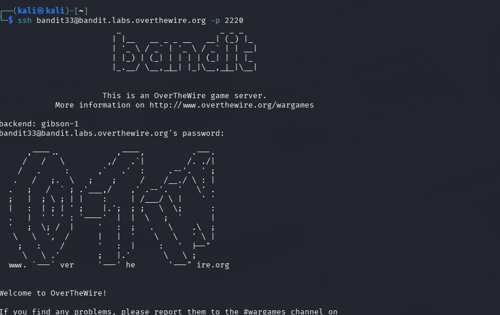

## Bandit Level 33 → Level 34

### 🎯 Objective
Log in to the Bandit game as bandit33 and verify the completion of the final level by reading the provided README file.

---

### 🔑 Credentials Provided
Username: bandit33  
Password: Obtained from previous level  

---

### 🔍 Method of Solve
After logging in to the final level, the completion message is stored inside a README file in the home directory. By listing the directory contents and reading the README file, the final confirmation message can be obtained.

---

### 🧪 Commands Used
- ssh bandit33@bandit.labs.overthewire.org -p 2220  
- ls  
- cat README.txt  

---

### 📸 Screenshots
  

---

### 🔑 Final Level Message
Congratulations on solving the last level of this game!

---

### 🧠 Explanation
The `ssh bandit33@bandit.labs.overthewire.org -p 2220` command was used to connect securely to the Bandit server as the final user.  
After successful authentication, the `ls` command listed the files present in the home directory.  
The file `README.txt` was identified as containing the final message.  
The `cat README.txt` command displayed the contents of the file, confirming that Bandit Level 33 is the last level and that the challenge has been successfully completed.

---

### 🔐 Concept Learned
This level reinforces the importance of basic Linux commands such as directory listing and file reading.  
It concludes the Bandit wargame by demonstrating that careful enumeration and attention to provided files are essential until the very end of a CTF challenge.
